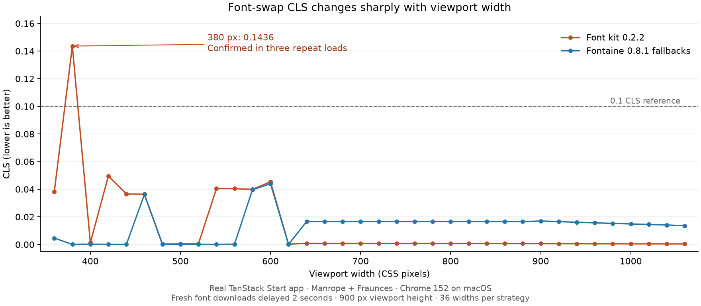

# Font kit: production browser evidence — September 14, 2026

**The package adds zero client JavaScript. The tests do not establish it as the best CLS option: they expose a repeatable regression at a 380 px viewport.** Its value is automatic font hosting, metric CSS, and Nitro integration with a small CSS cost. Its fallback selection still needs validation against each application's fonts and responsive layouts.

## The decisive counterexample

At **380 × 900**, with fresh font responses delayed two seconds:

| Strategy | Median CLS, three confirmation loads |
|---|---:|
| Font kit 0.2.2 | **0.143584** |
| Fontaine 0.8.1 fallbacks | **0.000092** |
| Plain self-hosted swap + preload | **0.033218** |
| Plain self-hosted swap | **0.033634** |

The kit result was identical in all three confirmation loads and in the original sweep observation. Its Manrope fallback paragraph was **216 px** tall before loading and **192 px** afterward. The CTA and card moved upward **24 px**. The headline height stayed unchanged. The browser's layout-shift entries identify paragraph, CTA, card/shadow, header, and footer movement when the font response completes. Arial metric fallback faces were loaded before the swap; Manrope was loaded afterward. This is not a missing-font or cached-font result.

The result exceeds the usual **0.1** good-CLS boundary. That boundary is a field target evaluated at the 75th percentile of real page loads; this individual stress-test result does **not** determine the deployed site's field Core Web Vitals status. [Google's CLS definition](https://web.dev/articles/cls).

The source prioritizes Arial for sans-serif fallbacks (`src/metrics.mjs`, `FALLBACK_TARGETS`). The recorded pre-swap face states confirm that path was exercised. Average glyph-width matching does not guarantee the same line breaks for this paragraph. This evidence identifies the failing rendering behavior; it does not establish a universally better fallback order.

## The full comparison

**214 measured navigations**, plus one preliminary instrumentation check:

- 108 main-matrix loads: six strategies × three probes × two viewports × three repetitions.
- 72 responsive loads: kit and Fontaine, each at 36 widths from 360 through 1060 px, height 900 px.
- 22 additional container stress loads: widths 280–480 px, with desktop typography retained.
- 12 confirmation loads at 380 px: four strategies × three repetitions.

The main matrix uses 390 × 844 and 1280 × 900. Values below are medians, including the header and footer, not just the probe element:

| Probe / viewport | Font kit | Fontaine | Swap + preload | Swap | Optional | System |
|---|---:|---:|---:|---:|---:|---:|
| hero / 390 px | 0.001547 | 0.000102 | 0.034072 | 0.034426 | 0.000000 | 0.000000 |
| tailwind / 390 px | 0.000275 | 0.000000 | 0.000000 | 0.000000 | 0.000000 | 0.000000 |
| normal / 390 px | 0.000275 | 0.000000 | 0.088741 | 0.088741 | 0.000000 | 0.000000 |
| hero / 1280 px | 0.000319 | 0.010464 | 0.000376 | 0.000376 | 0.000000 | 0.000000 |
| tailwind / 1280 px | 0.000218 | 0.000018 | 0.000000 | 0.000000 | 0.000000 | 0.000000 |
| normal / 1280 px | 0.000218 | 0.000018 | 0.023037 | 0.023037 | 0.000000 | 0.000000 |

At 390 px, the kit improves the preloaded hero from **0.034072 to 0.001547** (95.5%) and the normal-line-height probe from **0.088741 to 0.000275** (99.7%). It also introduces a small shift where plain loading already scores zero. Fontaine performs better on some probes and worse on the desktop hero.

Across the 36 responsive widths, the kit has the lower CLS at **22 widths**, Fontaine at **14**. The kit's median across widths is **0.000715**, versus Fontaine's **0.016314**. However, the kit's maximum is **0.143584**, versus **0.044001** for Fontaine. Nine kit widths exceed 0.02, versus three Fontaine widths. Both move the probe by as much as 48 px in this responsive sweep. These equally weighted test widths are **not** a real-user traffic distribution.

The extra narrow-container stress test shows why CLS alone is insufficient: retaining a 56 px desktop headline in a 280 px container produces **276 px** of kit probe displacement and **192 px** with Fontaine, much of it below the viewport. Those stress cases are deliberately separate from the app's normal responsive layout.

System fonts and `font-display: optional` score zero throughout the main matrix. System fonts download no fonts. Optional still downloads the fonts in this experiment but retains fallback rendering for the current delayed load: the mobile normal heading remains 188 px tall, while loaded Manrope renders it at 218 px. The choice changes typography delivery, so zero CLS alone does not make these interchangeable with swap. [Google's font-loading guidance](https://web.dev/learn/performance/optimize-web-fonts).

## JavaScript and actual download costs

Two independent production builds used the same application and dependency lockfile: one enabled this checkout's plugin; the other disabled it and imported its generated CSS as a static file. **All four JavaScript chunks and the stylesheet have identical filenames, byte counts, and SHA-256 hashes.** The client module audit contains 107 modules and no font-kit implementation, fontkit, capsize, wawoff2, or es-module-lexer modules.

| Cost | Uncompressed | gzip | Brotli |
|---|---:|---:|---:|
| Font kit's incremental client JavaScript | **0 B** | **0 B** | **0 B** |
| Incremental metric-fallback CSS, versus plain self-hosting | 4,698 B | **650 B** | **527 B** |
| JavaScript used by the hero route (two chunks) | 322,636 B | 102,113 B | 88,617 B |

The other two route chunks are not requested on the initial hero load. Module metadata points to React DOM, TanStack Router/Start, and serialization as the main application dependencies; compiler `renderedLength` values are pre-minification metadata, not additive final transfer sizes.

The two hero font downloads total **61,640 B**: Manrope 24,576 B and Fraunces 37,064 B. Kit and the other web-font variants use the same binaries. There are no duplicate font downloads in the recorded runs. The kit's 24 local fallback faces do not download font binaries.

The npm tarball is 73,156 B, unpacked 209,067 B. Those are installation sizes, not browser download costs.

**The local production Nitro server did not compress JavaScript**, even when `Accept-Encoding: gzip, br` was supplied. Its two initial JS responses therefore total 322,636 B before protocol overhead. The browser benchmark proxy explicitly enables gzip; its Resource Timing entries record compressed payloads around 102 kB, with small URL-rewriting differences. Brotli is an offline compression estimate, not an observed native response. Verify compression at the real deployment edge before assuming the 102 kB figure applies there. Immutable caching and the single `crossorigin` font preload header were present on the native server.

The font package's browser cost is justified by this evidence. Whether the entire React/TanStack bundle is justified depends on the application's interactive requirements; these font tests cannot answer that product decision.

## Method and limits

This is the real TanStack Start reference app at commit `93506fd58ce8b5385525cdda7df60885d397f2c7`, using **Manrope and Fraunces**, not the README's Poppins example. The kit source is commit `0591b0e1c736754bfa301f853de3fd73ab35d1ec` (0.2.2). The in-app browser reports Chrome 152 on macOS. Full versions, configurations, and hashes are in [environment.json](environment.json).

Each run uses fresh resource URLs and `no-store` responses. A measurement-only script is inserted before application code. It observes browser layout-shift entries without recent user input and computes the maximum session window. Pre-swap geometry and loaded fallback faces are checked against completed font requests. The observation lasts through fonts-ready plus a settling interval. The script is excluded from both production bundle comparisons.

Fontaine 0.8.1's **actual CSS transform** ran with default category fallbacks, against the same self-hosted, optical-size-pinned font files. Its documented fallback names were explicitly connected to the Tailwind font variables. It received the same body-font preload as the kit. This is a comparison of fallback generation, not a complete Fontaine download/preload integration or a test of fontless/unplugin-fonts. [Fontaine documentation](https://github.com/unjs/fontaine).

The two-second font delay is a controlled swap stress test, not a cellular bandwidth/CPU simulation. Paint timings are retained as raw observations but are not used for performance rankings. These tests do not cover Safari, Firefox, Windows/Linux local fallbacks, other fonts or writing systems, cached return visits, long sessions, route transitions, or 103 Early Hints. They cannot prove a universal best loader or field Core Web Vitals compliance.

## What to do with the evidence

1. Keep the build-time architecture: the zero-client-JavaScript claim is verified.
2. Address the 380 px Manrope fallback wrapping case before claiming best-in-class CLS. Evaluate representative text and fallback choices across the full responsive range; do not optimize only the 390 px fixture.
3. Make responsive regression evidence actionable in CI. The existing six-cell matrix passes here, while the repository's broader width sweep is currently diagnostic rather than gating.
4. Verify gzip/Brotli on the actual deployment. The uncompressed local JS response is a separate, much larger download-cost issue.

Production library code and the sibling reference app were left unchanged. Added artifacts are repository-only benchmark tools and evidence. Lint and type checking pass. **216 tests pass**; coverage is **87.35% lines, 80.93% branches, 82.16% functions**, above the configured gates. Browser warning/error capture is empty. Every recorded load passes the font-download and fallback-state validation.

Reproduce using [the benchmark instructions](../../../harness/browser-benchmark.md). Inspect [raw observations](raw-results.json), [validated summaries](raw-results-summary.json), [bundle hashes and module audit](bundle-audit.json), [native HTTP responses](native-responses.json), or the [vector chart](responsive-cls.svg).
